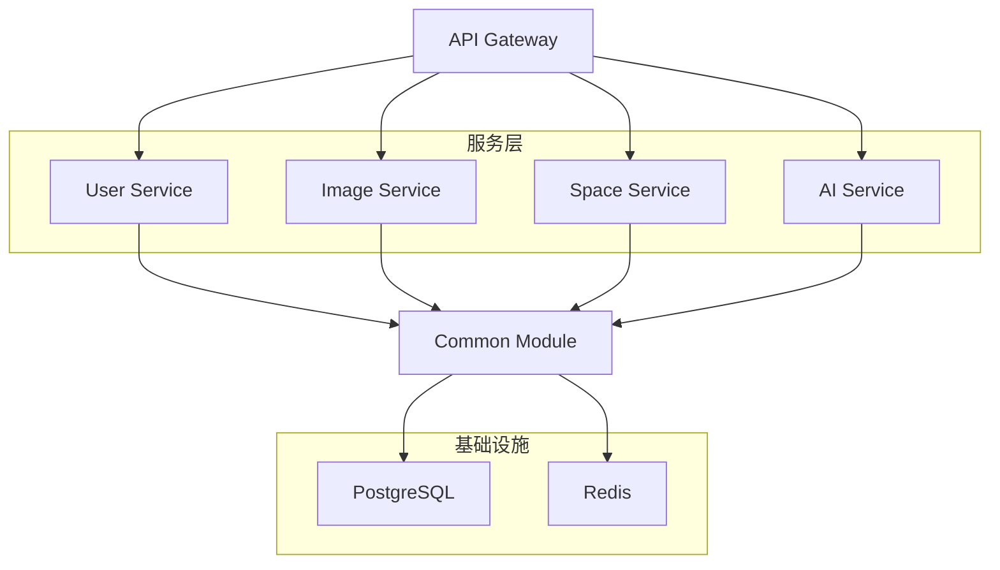

# Easy Image Hosting 项目架构分析与POM优化规划

## 1. 项目架构分析

### 1.1 微服务架构概览


### 1.2 技术栈分析
- **核心框架**: Spring Boot 3.4.5 + Spring Cloud 2024.0.2
- **微服务治理**: Spring Cloud Alibaba 2023.0.1.0 + Nacos
- **数据访问**: MyBatis Plus 3.5.12 + PostgreSQL
- **权限管理**: Sa-Token 1.44.0
- **缓存**: Redis + Spring Data Redis
- **API文档**: Knife4j 4.4.0 + OpenAPI 3

## 2. 当前POM配置问题分析

### 2.1 版本管理不一致
- Gateway模块独立声明Spring Boot版本，未继承父POM
- 各模块依赖版本分散管理，存在冲突风险

### 2.2 依赖配置重复
- Gateway模块重复声明dependencyManagement
- 缺少统一的依赖版本控制策略

### 2.3 构建配置缺失
- 缺少统一的构建插件配置
- 缺少多环境配置支持

## 3. 优化后的POM配置方案

### 3.1 根POM优化配置
```xml
<?xml version="1.0" encoding="UTF-8"?>
<project xmlns="http://maven.apache.org/POM/4.0.0"
         xmlns:xsi="http://www.w3.org/2001/XMLSchema-instance"
         xsi:schemaLocation="http://maven.apache.org/POM/4.0.0 
         http://maven.apache.org/xsd/maven-4.0.0.xsd">
    <modelVersion>4.0.0</modelVersion>
    
    <groupId>io.github.hoooosi</groupId>
    <artifactId>easy-image-hosting</artifactId>
    <version>1.0-SNAPSHOT</version>
    <packaging>pom</packaging>
    <name>Easy Image Hosting</name>
    <description>基于Spring Cloud Alibaba的图片托管系统</description>
    
    <modules>
        <module>common</module>
        <module>gateway</module>
        <module>user-service</module>
        <module>space-service</module>
        <module>image-service</module>
        <module>ai-service</module>
    </modules>
    
    <properties>
        <maven.compiler.source>17</maven.compiler.source>
        <maven.compiler.target>17</maven.compiler.target>
        <project.build.sourceEncoding>UTF-8</project.build.sourceEncoding>
        <project.reporting.outputEncoding>UTF-8</project.reporting.outputEncoding>
        
        <!-- 核心框架版本 -->
        <spring-boot.version>3.4.5</spring-boot.version>
        <spring-cloud.version>2024.0.2</spring-cloud.version>
        <spring-cloud-alibaba.version>2023.0.1.0</spring-cloud-alibaba.version>
        
        <!-- 数据访问版本 -->
        <mybatis-plus.version>3.5.12</mybatis-plus.version>
        <postgresql.version>42.7.2</postgresql.version>
        
        <!-- 工具类版本 -->
        <hutool.version>5.8.26</hutool.version>
        <guava.version>32.0.1-jre</guava.version>
        <sa-token.version>1.44.0</sa-token.version>
        
        <!-- API文档版本 -->
        <knife4j.version>4.4.0</knife4j.version>
        <springdoc.version>2.8.13</springdoc.version>
        
        <!-- 构建插件版本 -->
        <maven-compiler-plugin.version>3.8.1</maven-compiler-plugin.version>
        <maven-surefire-plugin.version>3.0.0-M7</maven-surefire-plugin.version>
    </properties>
    
    <dependencyManagement>
        <dependencies>
            <!-- Spring Boot 依赖管理 -->
            <dependency>
                <groupId>org.springframework.boot</groupId>
                <artifactId>spring-boot-dependencies</artifactId>
                <version>${spring-boot.version}</version>
                <type>pom</type>
                <scope>import</scope>
            </dependency>
            
            <!-- Spring Cloud 依赖管理 -->
            <dependency>
                <groupId>org.springframework.cloud</groupId>
                <artifactId>spring-cloud-dependencies</artifactId>
                <version>${spring-cloud.version}</version>
                <type>pom</type>
                <scope>import</scope>
            </dependency>
            
            <!-- Spring Cloud Alibaba 依赖管理 -->
            <dependency>
                <groupId>com.alibaba.cloud</groupId>
                <artifactId>spring-cloud-alibaba-dependencies</artifactId>
                <version>${spring-cloud-alibaba.version}</version>
                <type>pom</type>
                <scope>import</scope>
            </dependency>
            
            <!-- MyBatis Plus 依赖管理 -->
            <dependency>
                <groupId>com.baomidou</groupId>
                <artifactId>mybatis-plus-bom</artifactId>
                <version>${mybatis-plus.version}</version>
                <type>pom</type>
                <scope>import</scope>
            </dependency>
            
            <!-- 工具类依赖 -->
            <dependency>
                <groupId>cn.hutool</groupId>
                <artifactId>hutool-all</artifactId>
                <version>${hutool.version}</version>
            </dependency>
            
            <dependency>
                <groupId>com.google.guava</groupId>
                <artifactId>guava</artifactId>
                <version>${guava.version}</version>
            </dependency>
            
            <!-- Sa-Token 权限管理 -->
            <dependency>
                <groupId>cn.dev33</groupId>
                <artifactId>sa-token-spring-boot3-starter</artifactId>
                <version>${sa-token.version}</version>
            </dependency>
            
            <dependency>
                <groupId>cn.dev33</groupId>
                <artifactId>sa-token-redis-jackson</artifactId>
                <version>${sa-token.version}</version>
            </dependency>
            
            <!-- API文档 -->
            <dependency>
                <groupId>com.github.xiaoymin</groupId>
                <artifactId>knife4j-gateway-spring-boot-starter</artifactId>
                <version>${knife4j.version}</version>
            </dependency>
            
            <dependency>
                <groupId>org.springdoc</groupId>
                <artifactId>springdoc-openapi-starter-webmvc-ui</artifactId>
                <version>${springdoc.version}</version>
            </dependency>
        </dependencies>
    </dependencyManagement>
    
    <dependencies>
        <!-- 工具类 -->
        <dependency>
            <groupId>cn.hutool</groupId>
            <artifactId>hutool-all</artifactId>
        </dependency>
        
        <!-- Lombok -->
        <dependency>
            <groupId>org.projectlombok</groupId>
            <artifactId>lombok</artifactId>
            <optional>true</optional>
        </dependency>
        
        <!-- 测试依赖 -->
        <dependency>
            <groupId>org.springframework.boot</groupId>
            <artifactId>spring-boot-starter-test</artifactId>
            <scope>test</scope>
        </dependency>
    </dependencies>
    
    <build>
        <pluginManagement>
            <plugins>
                <plugin>
                    <groupId>org.apache.maven.plugins</groupId>
                    <artifactId>maven-compiler-plugin</artifactId>
                    <version>${maven-compiler-plugin.version}</version>
                    <configuration>
                        <source>${maven.compiler.source}</source>
                        <target>${maven.compiler.target}</target>
                        <parameters>true</parameters>
                        <encoding>${project.build.sourceEncoding}</encoding>
                    </configuration>
                </plugin>
                
                <plugin>
                    <groupId>org.apache.maven.plugins</groupId>
                    <artifactId>maven-surefire-plugin</artifactId>
                    <version>${maven-surefire-plugin.version}</version>
                    <configuration>
                        <skipTests>false</skipTests>
                    </configuration>
                </plugin>
                
                <plugin>
                    <groupId>org.springframework.boot</groupId>
                    <artifactId>spring-boot-maven-plugin</artifactId>
                    <version>${spring-boot.version}</version>
                    <configuration>
                        <excludes>
                            <exclude>
                                <groupId>org.projectlombok</groupId>
                                <artifactId>lombok</artifactId>
                            </exclude>
                        </excludes>
                    </configuration>
                </plugin>
            </plugins>
        </pluginManagement>
    </build>
    
    <!-- 多环境配置 -->
    <profiles>
        <profile>
            <id>dev</id>
            <properties>
                <spring.profiles.active>dev</spring.profiles.active>
            </properties>
            <activation>
                <activeByDefault>true</activeByDefault>
            </activation>
        </profile>
        
        <profile>
            <id>test</id>
            <properties>
                <spring.profiles.active>test</spring.profiles.active>
            </properties>
        </profile>
        
        <profile>
            <id>prod</id>
            <properties>
                <spring.profiles.active>prod</spring.profiles.active>
            </properties>
        </profile>
    </profiles>
</project>
```

### 3.2 Common模块优化配置
```xml
<?xml version="1.0" encoding="UTF-8"?>
<project xmlns="http://maven.apache.org/POM/4.0.0"
         xmlns:xsi="http://www.w3.org/2001/XMLSchema-instance"
         xsi:schemaLocation="http://maven.apache.org/POM/4.0.0 
         http://maven.apache.org/xsd/maven-4.0.0.xsd">
    <parent>
        <groupId>io.github.hoooosi</groupId>
        <artifactId>easy-image-hosting</artifactId>
        <version>1.0-SNAPSHOT</version>
    </parent>
    
    <modelVersion>4.0.0</modelVersion>
    <artifactId>common</artifactId>
    <packaging>jar</packaging>
    <name>Common Module</name>
    <description>公共模块，包含工具类、统一配置等</description>
    
    <dependencies>
        <!-- Sa-Token 权限管理 -->
        <dependency>
            <groupId>cn.dev33</groupId>
            <artifactId>sa-token-spring-boot3-starter</artifactId>
        </dependency>
        
        <dependency>
            <groupId>cn.dev33</groupId>
            <artifactId>sa-token-redis-jackson</artifactId>
        </dependency>
        
        <!-- MyBatis Plus -->
        <dependency>
            <groupId>com.baomidou</groupId>
            <artifactId>mybatis-plus-spring-boot3-starter</artifactId>
        </dependency>
        
        <dependency>
            <groupId>com.baomidou</groupId>
            <artifactId>mybatis-plus-jsqlparser</artifactId>
        </dependency>
        
        <!-- PostgreSQL -->
        <dependency>
            <groupId>org.postgresql</groupId>
            <artifactId>postgresql</artifactId>
        </dependency>
        
        <!-- Redis -->
        <dependency>
            <groupId>org.springframework.boot</groupId>
            <artifactId>spring-boot-starter-data-redis</artifactId>
        </dependency>
        
        <!-- AOP -->
        <dependency>
            <groupId>org.springframework.boot</groupId>
            <artifactId>spring-boot-starter-aop</artifactId>
        </dependency>
        
        <!-- 配置处理 -->
        <dependency>
            <groupId>org.springframework.boot</groupId>
            <artifactId>spring-boot-configuration-processor</artifactId>
            <optional>true</optional>
        </dependency>
    </dependencies>
</project>
```

### 3.3 Gateway模块优化配置
```xml
<?xml version="1.0" encoding="UTF-8"?>
<project xmlns="http://maven.apache.org/POM/4.0.0"
         xmlns:xsi="http://www.w3.org/2001/XMLSchema-instance"
         xsi:schemaLocation="http://maven.apache.org/POM/4.0.0 
         http://maven.apache.org/xsd/maven-4.0.0.xsd">
    <parent>
        <groupId>io.github.hoooosi</groupId>
        <artifactId>easy-image-hosting</artifactId>
        <version>1.0-SNAPSHOT</version>
    </parent>
    
    <modelVersion>4.0.0</modelVersion>
    <artifactId>gateway</artifactId>
    <packaging>jar</packaging>
    <name>API Gateway</name>
    <description>API网关服务，统一入口和路由转发</description>
    
    <dependencies>
        <!-- Spring Cloud Gateway -->
        <dependency>
            <groupId>org.springframework.cloud</groupId>
            <artifactId>spring-cloud-starter-gateway</artifactId>
        </dependency>
        
        <!-- Nacos 服务发现 -->
        <dependency>
            <groupId>com.alibaba.cloud</groupId>
            <artifactId>spring-cloud-starter-alibaba-nacos-discovery</artifactId>
        </dependency>
        
        <!-- 负载均衡 -->
        <dependency>
            <groupId>org.springframework.cloud</groupId>
            <artifactId>spring-cloud-starter-loadbalancer</artifactId>
        </dependency>
        
        <!-- Knife4j 网关文档 -->
        <dependency>
            <groupId>com.github.xiaoymin</groupId>
            <artifactId>knife4j-gateway-spring-boot-starter</artifactId>
        </dependency>
        
        <!-- 公共模块 -->
        <dependency>
            <groupId>io.github.hoooosi</groupId>
            <artifactId>common</artifactId>
            <version>${project.version}</version>
        </dependency>
    </dependencies>
    
    <build>
        <plugins>
            <plugin>
                <groupId>org.springframework.boot</groupId>
                <artifactId>spring-boot-maven-plugin</artifactId>
            </plugin>
        </plugins>
    </build>
</project>
```

### 3.4 业务服务模块通用配置模板
```xml
<?xml version="1.0" encoding="UTF-8"?>
<project xmlns="http://maven.apache.org/POM/4.0.0"
         xmlns:xsi="http://www.w3.org/2001/XMLSchema-instance"
         xsi:schemaLocation="http://maven.apache.org/POM/4.0.0 
         http://maven.apache.org/xsd/maven-4.0.0.xsd">
    <parent>
        <groupId>io.github.hoooosi</groupId>
        <artifactId>easy-image-hosting</artifactId>
        <version>1.0-SNAPSHOT</version>
    </parent>
    
    <modelVersion>4.0.0</modelVersion>
    <artifactId>xxx-service</artifactId>
    <packaging>jar</packaging>
    <name>XXX Service</name>
    <description>具体的业务服务模块</description>
    
    <dependencies>
        <!-- 公共模块 -->
        <dependency>
            <groupId>io.github.hoooosi</groupId>
            <artifactId>common</artifactId>
            <version>${project.version}</version>
        </dependency>
        
        <!-- Spring Boot Web -->
        <dependency>
            <groupId>org.springframework.boot</groupId>
            <artifactId>spring-boot-starter-web</artifactId>
        </dependency>
        
        <!-- 参数校验 -->
        <dependency>
            <groupId>org.springframework.boot</groupId>
            <artifactId>spring-boot-starter-validation</artifactId>
        </dependency>
        
        <!-- AOP -->
        <dependency>
            <groupId>org.springframework.boot</groupId>
            <artifactId>spring-boot-starter-aop</artifactId>
        </dependency>
        
        <!-- Nacos 服务注册发现 -->
        <dependency>
            <groupId>com.alibaba.cloud</groupId>
            <artifactId>spring-cloud-starter-alibaba-nacos-discovery</artifactId>
        </dependency>
        
        <!-- OpenAPI 文档 -->
        <dependency>
            <groupId>org.springdoc</groupId>
            <artifactId>springdoc-openapi-starter-webmvc-ui</artifactId>
        </dependency>
        
        <!-- 根据具体业务需求添加其他依赖 -->
    </dependencies>
    
    <build>
        <plugins>
            <plugin>
                <groupId>org.springframework.boot</groupId>
                <artifactId>spring-boot-maven-plugin</artifactId>
            </plugin>
        </plugins>
    </build>
</project>
```

## 4. 版本统一管理策略

### 4.1 版本管理原则
1. **集中管理**: 所有版本号统一在根POM的properties中定义
2. **兼容性优先**: 确保Spring Boot、Spring Cloud、Spring Cloud Alibaba版本兼容
3. **渐进升级**: 采用小版本逐步升级策略，避免大版本跳跃

### 4.2 版本兼容性矩阵
| Spring Boot | Spring Cloud | Spring Cloud Alibaba |
|-------------|--------------|---------------------|
| 3.4.5 | 2024.0.2 | 2023.0.1.0 |

## 5. 构建配置优化建议

### 5.1 统一构建配置
- 统一Java编译版本为17
- 统一编码格式为UTF-8
- 配置统一的Maven插件版本

### 5.2 多环境支持
- 开发环境(dev): 默认激活
- 测试环境(test): 测试服务器部署
- 生产环境(prod): 生产服务器部署

### 5.3 构建优化
```bash
# 跳过测试构建
mvn clean package -DskipTests

# 指定环境构建
mvn clean package -P prod

# 并行构建
mvn clean package -T 4
```

## 6. 依赖冲突解决方案

### 6.1 冲突检测
```bash
# 查看依赖树
mvn dependency:tree

# 查看冲突依赖
mvn dependency:analyze
```

### 6.2 冲突解决策略
1. **就近原则**: Maven默认选择路径最短的依赖
2. **显式声明**: 在根POM中显式声明需要的版本
3. **排除依赖**: 使用exclusions排除冲突依赖

### 6.3 常见冲突预防
- 统一日志框架（使用Logback）
- 统一JSON处理库（使用Jackson）
- 统一HTTP客户端（使用Spring的WebClient）

## 7. 实施建议

### 7.1 实施步骤
1. 更新根POM配置
2. 逐个更新子模块POM
3. 清理并重新构建项目
4. 运行测试验证功能

### 7.2 验证清单
- [ ] 所有模块能够正常编译
- [ ] 服务能够正常启动
- [ ] 依赖注入正常工作
- [ ] 数据库连接正常
- [ ] Redis连接正常
- [ ] 服务注册发现正常

通过以上优化，您的项目将拥有更好的依赖管理、更清晰的模块划分和更稳定的构建过程。